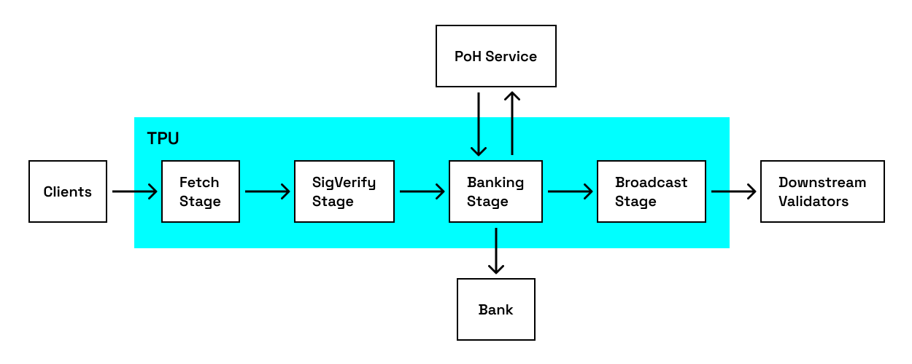

# Solana

## 目录

- [数据中心](#数据中心)
- [八大特性](#八大特性)
  - [1. PoH：高频可验证延迟函数](#1-poh高频可验证延迟函数)
  - [2. Tower BFT: PBFT 的 PoH 优化版](#2-tower-bft-pbft-的-poh-优化版)
  - [3. Turbine：解决可扩展性的三难困境](#3-turbine解决可扩展性的三难困境)
  - [4. Gulf Stream：无内存池交易转发协议](#4-gulf-stream无内存池交易转发协议)
  - [5. Sealevel：并行化](#5-sealevel并行化)
  - [6. Pipelining：Transaction Processing Unit (TPU)](#6-pipeliningtransaction-processing-unit-tpu)
  - [7. Cloudbreak：accounts database](#7-cloudbreakaccounts-database)
  - [8. Archivers：分布式账本存储](#8-archivers分布式账本存储)
- [数据结构](#数据结构)
  - [Account](#account)
    - [一般 Account：维护余额和数据](#一般-account维护余额和数据)
    - [System Program](#system-program)
    - [BPF Loader Program](#bpf-loader-program)
  - [Transaction：包含 1+指令](#transaction包含-1指令)
    - [结构(签名 64 字节+消息)](#结构签名-64-字节消息)
    - [费用](#费用)
- [程序](#程序)
  - [Program Derived Address (PDA)](#program-derived-address-pda)
  - [Cross Program Invocation (CPI)](#cross-program-invocation-cpi)
- [SDK](#sdk)
- [Reference](#reference)

---

## 数据中心

- AWS
- GCE
- Azure

## 八大特性

### 1. PoH：高频可验证延迟函数

- **顺序哈希链**：a sequential pre-image and collision resistant hash that runs over itself continuously with the previous output used as the next input.
- **定期记录计数和当前输出**
- **由此达到**：抗并行化+时间证明 - 将区块链数据插入该哈希链-->历史不可篡改、未来不可预测
- **生成串行、验证并行**(计算时间/内核数量)
- **消息要包含 PoH 哈希才算有效**

### 2. Tower BFT: PBFT 的 PoH 优化版 - 使用 PoH 作为网络时钟

1. **一次投票的起始超时为 N 个哈希**

   - 一旦对某个 PoH 哈希（记为 Hₖ）投票后，在至少 N 个后续哈希内，不会对任何非 Hₖ 子代的 PoH 哈希投票(否则罚没)
   - 为了方便管理，限制起始固定哈希时间 slot≈400ms->每隔一个 slot 对当前 PoH 哈希状态投票

2. **所有 predecessor 的超时时间翻倍**
   - 回滚 slotN 需要停滞 400ms\* 2^N

**实践中：**

- 验证者检查绝对多数(2/3)是否对承诺超时 10min 的时间段进行投票，如果没有就不投票
- 超时选票会被删除
  - 子投票超时>=父投票超时，父投票超时才会翻倍
  - 不然从哪里断开就从哪里重新计数
- 权益加权超时量最大的分叉将为网络产生最大数量的奖励 —— 抗分叉，因为奖励最大

### 3. Turbine： 解决可扩展性的三难困境(借鉴 BitTorrent)

- 仅使用 UDP(避免 TCP 重传开销)，将区块分片 + 随机路径传输 + 分层转发


- **Leader 将每个区块分解为最大 64kb 的包**
- **安全性**： Leader 生成 Reed-Solomon erasure codes(设置允许丢包率)，允许验证者在不接受全部数据包就能重建区块

### 4. Gulf Stream：无内存池交易转发协议

- 因为 leader 已知(epoch 会根据 pos 预先分配未来所有 slot 的 leader)，所以用户和验证者都**提前**把交易转发给预期 leader。 而 leader 收到后会在本地缓存先执行，等到 slot 到来时直接打包减少时间
  - 一般预测 24s 后的 leader

### 5. Sealevel：并行化(Solana 交易要求显式指定 Tx 是 read 还是 write)

- **Transaction**：数据结构灵感来源于 IO 设备

  1. 首先排序待处理 Tx
     - 可根据 cpu/gpu 客制化，比如按照 programid 排序
  2. 并行处理所有不重叠 Tx

- **Berkeley Packet Filter(BPF)**
  - 把 Tx 作为 BPF 字节码在 VM 运行(rBPF/SBF，是 eBPF 针对 solana 的特化版本)

### 6. Pipelining：Transaction Processing Unit (TPU)



1. **Fetch**：传入数据通过网卡从 kernel space 获取
2. **SigVerify**： GPU 处理签名验证
3. **Banking**： CPU 进行状态更新
4. **Write**： 处理后的 Tx 写回 kernel space 的磁盘，再由网卡传播

- **验证者的流水线线程**：
  - leader 使用 TPU 生成新 block
  - 其他验证者使用 Transaction Validation Unit (TVU)验证传播 leader 生成的 block

### 7. Cloudbreak：accounts database，公钥到 account 的映射；解决本地 levelDB 无法处理 5000TPS 的不妨碍硬件的软件

- 使用 memory-mapped files
- 使用 sequential operations
  - 拆解 account 数据结构实现
    1. account 的 index 和 forks 存在 RAM
    2. account 存在最大为 4MB 的 memory-mapped files
    3. 每条 memory map 只存来自单个 proposed fork 的 accounts
    4. maps 随机分布在尽可能多的可用 ssd 中
    5. Copy-on-write semantics are used ----->顺序写入+
    6. 写入被附加到同一个 fork 的随机 memory map -----> 跨 ssd 写入->由此并发 Tx
    7. 每次写入完成更新 index
- 还有 GC

### 8. Archivers：分布式账本存储存 Tx 历史数据———— 21/10/2024 还未实现 🤣

## 数据结构

### Account

#### 一般 Account：维护余额和数据

```rust
基础模型
pub struct Account {
    /// lamports in the account
    pub lamports: u64,
    /// data held in this account
    #[cfg_attr(feature = "serde", serde(with = "serde_bytes"))]
    pub data: Vec<u8>,
    /// the program that owns this account. If executable, the program that loads this account.
    pub owner: Pubkey, // 控制 account 状态变化的 program 的公钥
    /// this account's data contains a loaded program (and is now read-only)
    pub executable: bool,
    /// the epoch at which this account will next owe rent
    pub rent_epoch: Epoch,  // 已弃用，以前用来定期取租金
}
```

- 一个账户最多 10MiB，需支付与数据量成比例的押金
- **特殊 Accounts**：
  - **Sysvar**：存储网络集群状态的特殊账户https://docs.anza.xyz/runtime/sysvars可查询list
  - **Program**：代码，=智能合约，无状态
    - 只能更改 own 的 account 的 data 且 debit
    - 可以为任何 account credit
    - 可以 read any account
    - loader-v3 中直指向代码地址，代码存在 program executable data account(实际上不可置信)，和 program account 的 owner 都是 BPF loader
  - **Data**： Program 创建的，存储和管理 Program 的状态，owner 是对应 Program
  - **Ed25519 公钥为地址**

#### System Program：默认是所有 account 的 owner(所有 wallet 的 owner，只有 owner 是 system program 的 account 才能支付费用)

- 唯一可以分配 account 所有权的 program
- 唯一可以分配 0 初始化数据的 program
- account 生命周期内只能换一次 owner

#### BPF Loader Program：加载用户自定义 program，通过以下 Tx 步骤实现

1. 创新公钥
2. transfer coin 给 key
3. 让 system program 给该 key 分配内存
4. 让 system program 把该 key 的 owner 变成 BPF loader Program
5. 把字节码分段上传到内存
6. 让 BPF loader program 将内存标记为 executable

- 此时 BPF loader program 验证字节码，字节码 load 的 account 就是用户自定义 program

### Transaction：包含 1+指令

- 多个指令顺序执行
- 原子性的，所有指令必须成功，否则 Tx 失败
- 包括调用网络上 program 的指令
- 最大 1232 bytes，因为 IPv6 MTU 1280 bytes-header 48 bytes

#### 结构(签名 64 字节+消息)

```
pub struct Transaction {
    #[wasm_bindgen(skip)]
    #[serde(with = "short_vec")]
    pub signatures: Vec<Signature>,

    #[wasm_bindgen(skip)]
    pub message: Message,
}

```

消息包括：

- 消息头(singer 1bytes +只读签名 accounts 数量 1bytes+只读未签名 accounts 数量 1 bytes)
- 账户地址(指令所需 accounts 的地址数组)
- 最近区块哈希(作为时间戳)
- 指令(指令数组)

  - 必要三部分

    1.  要调用的 program 地址
    2.  read/write 的 accounts(具体内容看 sdk 定义)
    3.  数据(比如 program 的参数)

  一般存在于 Program 中，作为 public 函数

#### 费用

- 基础费用：一个签名 5000 lamports，一半销毁，一半给验证者
- 优先费用= 计算单元(CU)限制(最大 140w，默认 20w)\*计算单元价格(单位微 lamports,1,000,000:1 lamport)

## 程序

### Program Derived Address (PDA)

预输入 seed 和指定 programId == 唯一地址，所以 program 运行时可以为 programId 推导的 pda 签名

- Ed25519 曲线外，所以没有私钥
- 不会自动创建链上 account，如果要把 pda 作为 account 要用 program 的指令创建

常见用途： ATA、CPI

### Cross Program Invocation (CPI)

一个 program 调用另一个 program 的指令

## Compared with eth

### 1. 账户模型

**以太坊：耦合式账户模型**

- 以太坊采用账户-余额模型，每个账户（包括外部账户和合约账户）直接存储其状态（如余额、nonce、合约代码等）
- 智能合约既包含代码逻辑，又存储状态数据，代码与状态耦合，安全性较低（如合约所有者权限容易被篡改）
- 账户数据结构：
  - nonce
  - balance
  - storageRoot
  - codeHash

**Solana：解耦式账户模型**

- Solana 采用分离式账户模型，将 program 和 data 解耦：program account + data account(SPL token program 管理 mint account 和 token account)
- 安全性较高

### 2. 状态存储

**以太坊：全局状态树（MPT）**

- 使用 Merkle Patricia Trie (MPT) 存储全局状态：
  - 状态树（State Trie）：记录所有账户的当前状态（stateRoot）
  - 交易树（Transactions Trie）：记录区块内的交易（transactionsRoot）
  - 收据树（Receipts Trie）：记录交易执行结果（receiptsRoot）
- 随着状态增长，MPT 的存储和计算开销增加，影响可扩展性

**Solana：账户式存储**

- data/状态分散在独立 account 中
- 并行处理：不同 account 的状态可独立修改（Sealevel 并行引擎支持）
- 更低存储开销：无需维护庞大的全局状态树

### 3. Tx 结构

**以太坊：单指令 Tx**

- 每笔 Tx 包含：
  - from（发送方）
  - to（接收方/合约）
  - data（调用数据）
  - gasLimit、gasPrice 等
- 通过 event log 和合约存储来追踪 token 余额
- decode Tx 相对简单，有可复用模板
- 执行方式：串行执行：EVM 按顺序处理 Tx，限制吞吐量

**Solana：多指令 Tx**

- 每笔 Tx 可包含多个指令
- decode Tx 会更麻烦，要针对到不同 program 的 IDL
- 执行方式：并行执行：Sealevel 引擎分析账户依赖关系，无冲突的交易可并行处理

### 4. 底层数据结构

**以太坊：基于默克尔树**

- MPT（Merkle Patricia Trie）：
  - 结合 Merkle Tree（防篡改）和 Patricia Trie（压缩存储）
  - 适用于频繁更新的状态（如账户余额）

**Solana：Account 索引+PoH(时间戳确保顺序)**

### 5. 区块结构

**以太坊：区块包含完整交易和状态**

- 区块结构：
  - 区块头（parentHash, stateRoot, transactionsRoot 等）
  - Tx 列表
  - 叔块（Uncles）（PoW 时代的遗留机制）

**Solana：轻量级区块**

- Slot：400ms/slot，Leader 负责打包 Txs
- 区块：
  - 仅包含 Tx 数据和 PoH 哈希，不存储完整状态(验证者本地节点维护)
  - 通过 Turbine 分片传播（Reed-Solomon 纠删码优化）

### 总结对比

| 特性     | 以太坊                     | Solana                         |
| -------- | -------------------------- | ------------------------------ |
| 账户模型 | 耦合式（代码+状态）        | 解耦式（program+data account） |
| 状态存储 | 全局 MPT 树                | 分散式账户存储                 |
| 交易结构 | 单指令，串行执行           | 多指令，并行执行（Sealevel）   |
| 数据结构 | Merkle Patricia Trie (MPT) | account 索引 + PoH 时间戳链    |
| 区块传播 | 完整区块广播               | Turbine 分片传播（纠删码）     |

## SDK

- **kit**：https://solana-kit-docs.vercel.app/
- **gill**：https://github.com/DecalLabs/gill

## Reference

https://medium.com/solana-labs/proof-of-history-a-clock-for-blockchain-cf47a61a9274
https://solana.com/zh/docs/core
